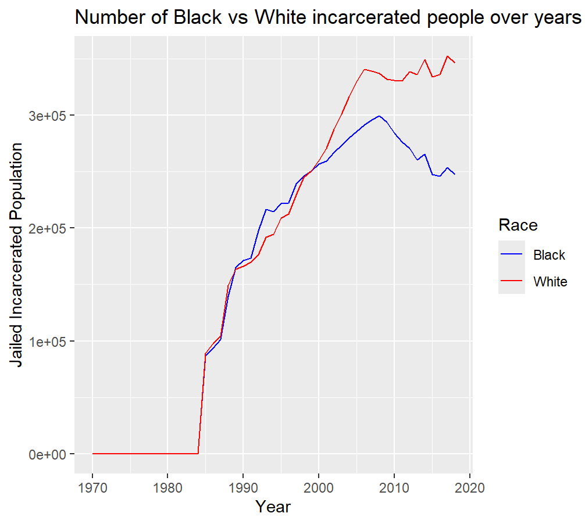

### Introduction

This report will be about the race inequality rate of incarceration and how many of each races are in Prison and Jail, and the rise of incarceration rate over the years. I want to specifically focus on the AAPI, and Black variables since I believe the Black population have the worst experience with inequlity relating to incarceration, and I also want to do AAPI since i'm curious about the data of my own race.

### Summary Information

Write a summary paragraph of findings that includes the 5 values calculated from your summary information R script

These will likely be calculated using your DPLYR skills, answering questions such as: 

- What is the average value of my variable across all the counties (in the current year)?
- Where is my variable the highest / lowest?
- How much has my variable change over the last N years?

Feel free to calculate and report values that you find relevant. Again, remember that the purpose is to think about how these measure of incarceration vary by race.

### The Dataset

This data was collected by Vera institute, and was collected by using the dataset collected by US department of of justice Bureau of of justice statistics. Specifically, the data sets used in this collection are the NCRP (National corrections reporting program), DCRP (Deaths in custody reporting program), ASJ (Annual survey of jails), and the Census of Jail data set.This data was collected and generated by combining medium with small metropolitan areas, and micropolitan with non-core areas. And with the population, the dataset was collected to include only datas from the age 15-64 including male and female, and 5 race categories. They started collecting this data, because the rest of the datas about incarceration does not unpack the. In my data there are about 153811 rows and 36 columns. Some ethical questions needed to consider when working with this data are how long are these people in jail/prison for? and Were there any biases or limitations in the data collection process that might affect the accuracy or fairness of the findings? Some possible limitations coming from this data can be some missing datas from certain prisons and jail, affecting the locations for dataset and calculations. There's also another problem that might be a problem with what considers as being incarcerated such as pretrial detention, alternative sentencing programs, and disparities in access to legal representation.

### Trends Over Time Chart


This chart provides the trends of AAPI population in all the states, and gathers the states that are top 5 population wise, and gathers it on the data. From this data, it's easy to see that the number one is Hawaii, and lowest one out of the top 5 is Colorado. 
```

### Variable Comparison Chart




This chart compares the population of White incacerated people and number of black incarcerated individuals over the years of 1970-2020. I included this chart since I wanted to know the simple differnce between the population, and if these 2 datas had any significant differences. It occured to me that even thought the chart says the population for white incarcerated individuals are higher, I believe the rate for black incarcerated individuals are higher, since they have a lower population in the U.S. and having the numbers be the same as white incarcerated populations in some years tell us the rate is a lot higher. 


### Map


For my map chart, I decided to collect the national data of the Black population in Jail, and displayed it on the map. With the legend, we can see that the lighter the color, more of the black population is in Jail, and with this map we can see taht states such as California, Texas, and Florida have the highest black incarcerated rate in the US.

